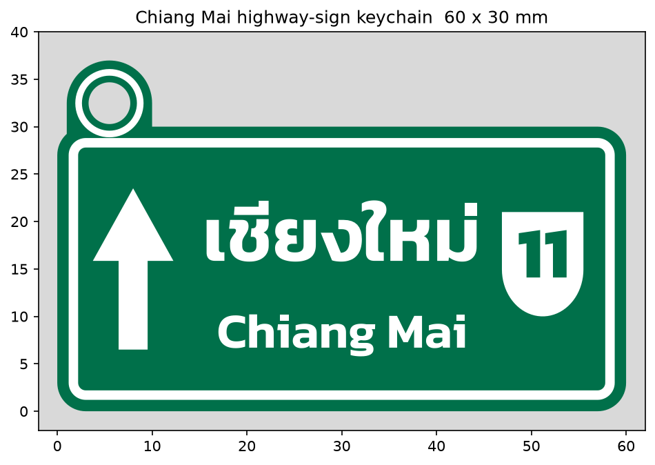
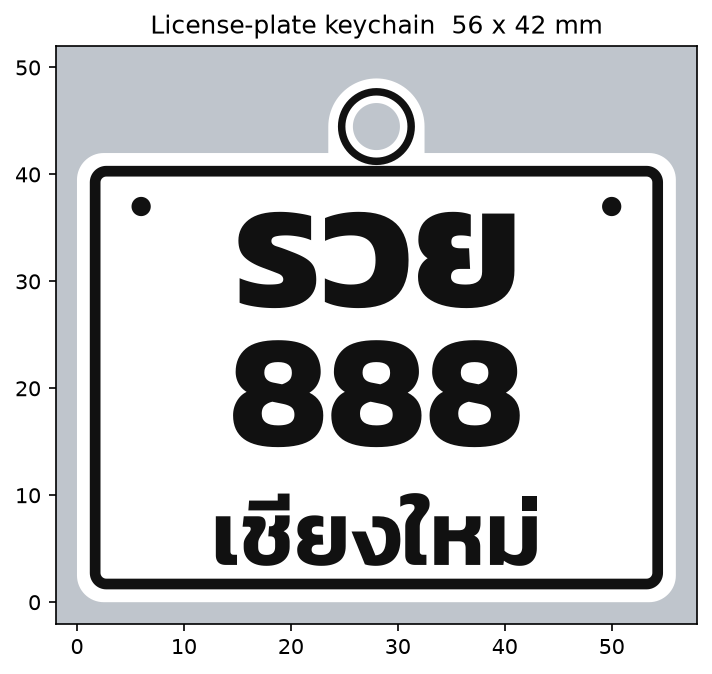

# พวงกุญแจป้ายทางหลวง "เชียงใหม่"



ป้ายบอกทางสีเขียวแบบทางหลวงไทย: ลูกศรตรงไป + "เชียงใหม่ / Chiang Mai" + โล่ทางหลวงหมายเลข 11
ขนาด 60 × 30 มม. (รวมหูห้อย ~37 มม.) หนา 3.2 มม., รูพวงกุญแจ Ø4.4 มม.

## ไฟล์ (`output/`)
| ไฟล์ | ใช้ทำอะไร |
|---|---|
| `chiangmai_keychain_2color.3mf` | 2 ชิ้นแยกสี (เขียว/ขาว) — เปิดใน Bambu Studio แล้วกำหนดสีได้เลย |
| `chiangmai_base_green.stl` | ฐานป้ายสีเขียว (z 0–2.4 มม.) |
| `chiangmai_relief_white.stl` | ขอบ/ตัวอักษร/ลูกศร/โล่ สีขาว (z 2.4–3.2 มม.) |
| `chiangmai_keychain_single.stl` | รวมเป็นชิ้นเดียว สำหรับพิมพ์สีเดียวหรือเปลี่ยนสีกลางทาง |

## การพิมพ์ (Bambu Lab A1 / PLA)
- **มี AMS Lite:** เปิด `.3mf` → ตอบ "Yes" ให้โหลดเป็นชิ้นเดียวหลายส่วน → ตั้ง base = เขียว, relief = ขาว
- **ไม่มี AMS:** ใช้ `single.stl` แล้วเพิ่ม *Filament change* (Pause) ที่ความสูง **2.4 มม.** สลับจากเขียวเป็นขาว
- Layer height 0.2 มม. (first layer 0.2), infill 100% หรือ 15% + 3 walls, ไม่ต้องใช้ support
- วางด้านเรียบลงบนฐาน (ตามไฟล์)

## ปรับแต่ง
แก้ค่าด้านบนของ `make_keychain.py` (ขนาด, ความหนา, เลขทางหลวง `ROUTE`, ข้อความ) แล้วรัน
```bash
pip install trimesh shapely manifold3d numpy matplotlib fonttools uharfbuzz networkx lxml mapbox_earcut
python3 make_keychain.py
```
ฟอนต์ Kanit (SIL OFL, อยู่ใน `../fonts/`) จัดรูปสระ/วรรณยุกต์ไทยด้วย HarfBuzz

---

# พวงกุญแจป้ายทะเบียนรถ "รวย 888 เชียงใหม่"



แบบป้ายรถยนต์ส่วนบุคคล พื้นขาว ตัวอักษร/ขอบสีดำนูน 0.8 มม. จัด 3 บรรทัด (รวย / 888 / เชียงใหม่) ขนาด 56 × 42 มม. (รวมหูห้อย ~49 มม.) หนา 3.2 มม.

| ไฟล์ | ใช้ทำอะไร |
|---|---|
| `plate_keychain_2color.3mf` | 2 ชิ้นแยกสี: base = ขาว, relief = ดำ |
| `plate_base_white.stl` / `plate_relief_black.stl` | แยกสีเป็น STL |
| `plate_keychain_single.stl` | ชิ้นเดียว — ตั้ง Filament change ที่ **2.4 มม.** (ขาว → ดำ) |

เปลี่ยนข้อความได้ที่ `LINE1` / `LINE2` / `PROVINCE` ใน `make_plate.py` แล้วรัน `python3 make_plate.py`
